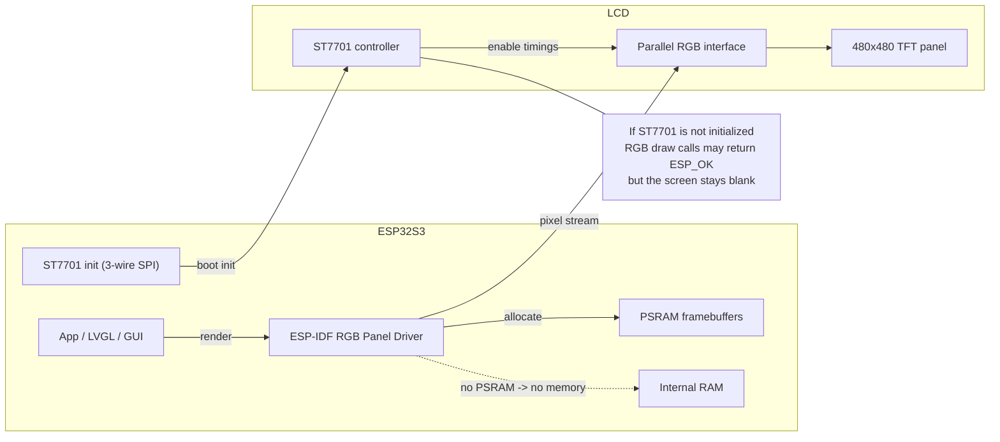
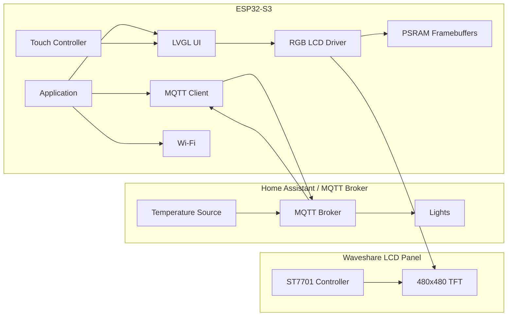
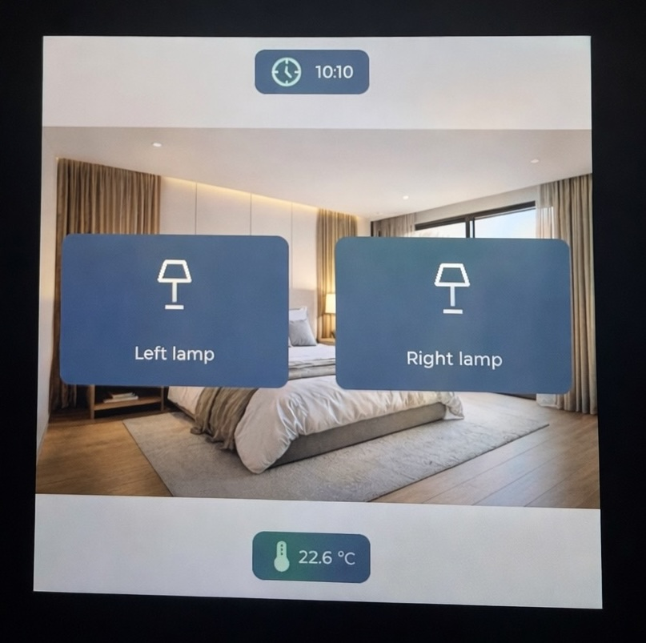

  
# 🖥️ Waveshare ESP32-S3-Touch-LCD-4 — LVGL Dashboard (ESP-IDF)

## 📘 Introduction

This repository documents how to **actually make the Waveshare ESP32-S3-Touch-LCD-4 board work** (480×480 display, ST7701 controller + RGB interface).

After numerous unsuccessful attempts using **Arduino** and **ESPHome**, all of which ended in failure,
I finally managed to get this board working properly by using **Espressif’s ESP-IDF**.

This repository shares the required configuration, findings, and lessons learned,
with the goal of saving others from wasting time on the same dead ends.

Hopefully, this will be useful to you 😀.

## 🛠️ Hardware Components

> Equipment : Waveshare ESP32-S3-Touch-LCD-4  
> LCD : RGB 480×480 + controler **ST7701** initialized via SPI 3-wire  
> Touch : GT911 (I²C)  
> IO Expander : TCA9554 (I²C, 0x24)  
> Flash/PSRAM : 16MB / 8MB PSRAM 
> Wiki + schémas : Waveshare  [oai_citation:1‡Waveshare Electronics](https://www.waveshare.com/wiki/ESP32-S3-Touch-LCD-4?srsltid=AfmBOope1FwUCfc4iPT0jm7qCOWfa2dng7qnEUNr_7eFYw2h0RY4MIbC&utm_source=chatgpt.com)

---

## ⚠️ Why it did not work (or worked poorly) with Arduino IDE / ESPHome

### 1️⃣  The LCD pipeline is **dual**
On this board, the display path is split into:
- **Parallel RGB** (PCLK / HS / VS / DE + 16 data pins): video stream
- **3-wire SPI** (SCL / SDA / CS): **ST7701 initialization** at boot

If the ST7701 is not properly initialized, the RGB driver may return `ESP_OK`
for `draw_bitmap()` calls **while the screen remains completely blank**.



### 2️⃣ Framebuffer memory (PSRAM) is mandatory
A 480×480 framebuffer in RGB565 is approximately **460 KB**.  
Depending on the number of buffers and DMA alignment requirements,
allocation in internal RAM may fail (`ESP_ERR_NO_MEM`).

Under Arduino, PSRAM allocation had to be explicitly forced (`fb_in_psram=1`).  
On the BSP side, this flag was not applied (see fix below).

### 3️⃣ PSRAM mode (Quad vs Octal) on ESP-IDF
Under ESP-IDF, an incorrect PSRAM configuration causes an immediate reboot:
`PSRAM ID read error: 0x00ffffff ... wrong PSRAM line mode`

This symptom is typical of a **Quad vs Octal mismatch** on ESP32-S3.  
(see related ESP-IDF issue)

### 4️⃣ ESP-IDF “dev” (6.x-dev) = traps
The Waveshare BSP targets stable ESP-IDF releases (>= 5.3).  
Using an ESP-IDF dev branch may result in build or link errors.

---

## ✅ Stable solution: ESP-IDF + official Waveshare BSP

The most reliable approach is to use the **official Waveshare BSP** published in the
ESP Component Registry.

### Prerequisites (macOs)
- macOS with Xcode Command Line Tools installed
- **ESP-IDF v5.4.x** recommended (>= 5.3 required by the BSP)
---

## 🛠 Installation ESP-IDF (macOS)

```bash
xcode-select --install

mkdir -p ~/esp
cd ~/esp
git clone --recursive https://github.com/espressif/esp-idf.git
cd esp-idf
git fetch --tags
git checkout v5.4.1
git submodule update --init --recursive
./install.sh esp32s3
. ./export.sh

idf.py --version
ESP-IDF v5.4.1
```

Project creation + adding the BSP

```bash

idf.py create-project esp32-s3-touch-lcd-ha-dashboard
cd esp32-s3-touch-lcd-ha-dashboard
idf.py set-target esp32s3

idf.py add-dependency "waveshare/esp32_s3_touch_lcd_4^2.0.0"

```


## 🔧 Required BSP fixes (observed in practice)

### A) Add `<string.h>` (compilation bug)

**Error encountered:**
```
implicit declaration of function ‘memcpy’
```
**Fix (in the managed component):**

**File:** 
managed_components/waveshare__esp32_s3_touch_lcd_4/esp32_s3_touch_lcd_4.c

Add :

```c
#include <string.h>

```
> Note: changes made under `managed_components/` may be overwritten when updating dependencies.

### B) Force framebuffers into PSRAM (otherwise `ESP_ERR_NO_MEM`)

**Error encountered:**
```c
lcd_rgb_panel_alloc_frame_buffers: no mem for frame buffer
```

In the same BSP file, locate the structure:
```c
esp_lcd_rgb_panel_config_t rgb_config = { ... };
```

Right after the structure definition, force :

```c
rgb_config.flags.fb_in_psram = 1;
rgb_config.num_fbs = 1;
```
---

## 🚨 PSRAM configuration (CRITICAL)

In `idf.py menuconfig`:

Component config → ESP PSRAM  
- Enable PSRAM  
- Select the correct PSRAM mode:
  - **OCTAL Mode PSRAM** (often required on this board / module)
  - If you encounter a `wrong PSRAM line mode` error, try the other option:
    **QUAD Mode PSRAM**

**Reference symptom:**
```c
PSRAM ID read error: 0x00ffffff
```

**Build / Flash / Monitor**

```bash
idf.py fullclean
idf.py build
idf.py -p /dev/cu.usbmodemXXXX flash monitor
```


---


## 🔌 Mapping GPIO — Waveshare ESP32-S3-Touch-LCD-4 (480×480)

Ce tableau résume **le mapping réel et fonctionnel** du board Waveshare ESP32-S3-Touch-LCD-4, tel qu’utilisé par le BSP officiel et validé en pratique.

> ⚠️ Important  
> - Le LCD est **RGB parallèle** (flux vidéo)  
> - Le contrôleur **ST7701** est initialisé via **SPI 3-wire**  
> - Plusieurs signaux critiques passent par un **IO expander I²C (TCA9554)**

---

### 1️⃣ Power & contrôle LCD (via IO Expander)

| Fonction        | Composant | GPIO ESP32-S3 | Détail |
|----------------|----------|---------------|--------|
| Backlight EN   | TCA9554  | EXIO2 (P1)    | **BL_EN** – doit être HIGH |
| LCD Reset      | TCA9554  | EXIO3 (P2)    | **LCD_RST** (pulse) |
| Touch Reset    | TCA9554  | EXIO1 (P0)    | **TP_RST** |

IO Expander :
- **Type** : TCA9554  
- **Adresse I²C** : `0x24`

---

### 2️⃣ Bus I²C (Touch, IO Expander, RTC)

| Fonction | GPIO ESP32-S3 |
|--------|---------------|
| SDA    | GPIO15 |
| SCL    | GPIO7  |

I²C addresses observed on the bus :
- `0x24` → **TCA9554** (IO Expander)
- `0x5D` → **GT911** (Touch)
- `0x51` → RTC (probable)

---

### 3️⃣ Touch Panel (GT911)

| Fonction | GPIO ESP32-S3 | Détail |
|--------|---------------|--------|
| I²C SDA | GPIO15 | Partagé |
| I²C SCL | GPIO7  | Partagé |
| INT     | GPIO16 | Touch interrupt |
| RESET   | EXIO1  | Via TCA9554 |

---

### 4️⃣ LCD — RGB synchronization signals

| Signal | GPIO ESP32-S3 |
|------|---------------|
| HSYNC | GPIO38 |
| VSYNC | GPIO39 |
| DE    | GPIO40 |
| PCLK  | GPIO41 |
| DISP  | (géré par BSP) |

---

### 5️⃣ LCD — Bus RGB Data (16 bits)

The LCD uses a **16-bit parallel RGB** bus.  
The exact order is **critical** and depends on the PCB.

Mapping validated (D0 → D15) :

| Data bit | GPIO |
|---------|------|
| D0 | GPIO14 |
| D1 | GPIO13 |
| D2 | GPIO12 |
| D3 | GPIO11 |
| D4 | GPIO10 |
| D5 | GPIO9  |
| D6 | GPIO46 |
| D7 | GPIO3  |
| D8 | GPIO8  |
| D9 | GPIO18 |
| D10 | GPIO17 |
| D11 | GPIO5  |
| D12 | GPIO45 |
| D13 | GPIO48 |
| D14 | GPIO47 |
| D15 | GPIO21 |


**LCD RGB Data (16-bit)**

The data pins are divided into R/G/B groups (see table in the diagram).
Example of a successfully used set (order D0..D15 according to RGB driver):

```c
[14, 13, 12, 11, 10, 9, 46, 3, 8, 18, 17, 5, 45, 48, 47, 21]

```

> Note : this type of RGB panel, the exact order D0..D15 (and the R/G/B correspondence) depends on the PCB mapping. Refer to the diagram and/or the BSP that encapsulates the configuration.
> This mapping corresponds to the configuration used by the Waveshare BSP and validated with an RGB565 framebuffer in PSRAM.

---

### 6️⃣ SPI — Initialisation ST7701 (3-wire)

The ST7701 **is not an SPI display**, but **it must be initialized via SPI** before the RGB will work.

| Signal | GPIO ESP32-S3 |
|------|---------------|
| CS   | GPIO42 |
| SCL  | (interne BSP) |
| SDA  | (interne BSP) |

> The SPI bus is **only used at boot time** to send the ST7701 initialization sequence.  
> Then, only parallel RGB is active.

---

## 🧪 Troubleshooting checklist

Black screen but no crash
	•	Backlight ON ? (BL_EN via TCA9554)
	•	ST7701 initialized ? (logs st7701: version ...)
	•	draw_bitmap ESP_OK but nothing changes => ST7701 not configured or incorrect RGB timings/polarity

Crash ESP_ERR_NO_MEM during esp_lcd_new_rgb_panel
	•	Init PSRAM in IDF  menuconfig
	•	Forcergb_config.flags.fb_in_psram = 1
	•	Reduce to num_fbs = 1

Reboot with PSRAM ID read error ... wrong PSRAM line mode
	•	Change Quad Mode PSRAM ↔ Octal Mode PSRAM 
    
The BSP requires ESP-IDF >= 5.3. 
	•	Avoid IDF dev versions (6.x-dev) for this board as long as the BSP does not explicitly announce support.

---

## 🎛 Example: LVGL Light Control Dashboard

This repository includes a simple example demonstrating how to build a **touch dashboard**
on the Waveshare ESP32-S3-Touch-LCD-4 using **LVGL**.

The example displays:
- A full-screen background image
- Two touch buttons to **turn lights ON / OFF**
- Time display
- Temperature display
- Custom icons and UI elements

The application uses an **MQTT server** to control the lights, but it can be easily
adapted to other communication methods (HTTP, local GPIO, Home Assistant API, etc.).

### System Architecture Diagram


---

### 🖼️ Screenshots


---
### LVGL Images

All graphical assets used by the UI were converted into **C image structures**
using the official **LVGL Image Converter**:
- Background image
- Button icons (ON / OFF)
- Clock display graphics
- Temperature display graphics

This allows the UI to run fully embedded without requiring a filesystem.

### Requirements

- ESP-IDF (recommended v5.4.x)
- LVGL
- MQTT broker (e.g. Mosquitto / Home Assistant)

### MQTT Configuration and Topics

MQTT topics are defined in `mqtt_config.c` and used by the LVGL UI to control two lights (left/right) and display room temperature.

#### Topics

| Purpose | Topic |
|--------|-------|
| Left lamp command | `home/roo1panel/lamp_left/cmd` |
| Left lamp state | `home/roo1panel/lamp_left/state` |
| Right lamp command | `home/roo1panel/lamp_right/cmd` |
| Right lamp state | `home/roo1panel/lamp_right/state` |
| Temperature | `home/roo1panel/temperature` |
| Panel status | `home/roo1panel/status` |

**Notes**
- The ESP32 publishes commands to `*/cmd` when a button is pressed.
- The UI can optionally reflect the actual light state by subscribing to `*/state`.
- Temperature updates are received via `home/roo1panel/temperature`.

---

### Wi-Fi Configuration

Wi-Fi credentials and settings are defined in:

- `wifi_config.c`

You must update this file with your own Wi-Fi parameters before building/flashing.

---

### LVGL Assets (C Image Files)

All icons and the background are embedded as C structures (generated with the **LVGL Image Converter**) and stored in the following files:

- Temperature icons: `ui_thermostat_icon.c`
- Clock icon: `ui_img_clock_icon.c`
- Lamp button icons: `floor_lamp.c`
- Background image: `backg_room1.c`
These topics are only examples and can be easily modified in the source code.

---


## 🔚 Conclusion

This board works perfectly, but:
	•	The Waveshare and Arduino documentation are insufficient
    •    The PSRAM must be configured correctly
    •    The ST7701 must be initialized correctly
    •    The ESP-IDF BSP is currently the most reliable solution

---

## 📚 References

[Waveshare/esp32_s3_touch_lcd_4](https://components.espressif.com/components/waveshare/esp32_s3_touch_lcd_4/versions/1.0.3/dependencies?language=en)

[Waveshare ESP32-S3 4inch Display Development Board](https://www.waveshare.com/esp32-s3-touch-lcd-4.htm?sku=28154)

[Getting Started with ESP-IDF](https://idf.espressif.com/)

[LVGL Library](https://lvgl.io/)

[LVGL Image Converter](https://lvgl.io/tools/imageconverter)